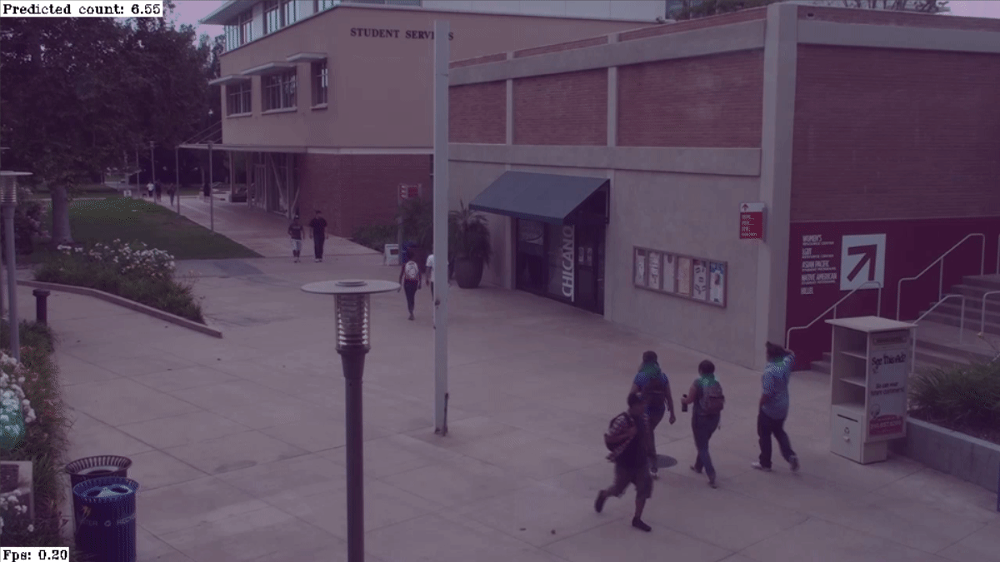

## [Gen2] Crowd Counting with density maps on DepthAI

This example shows an implementation of Crowd Counting with density maps on DepthAI in the Gen2 API system.  We use [DM-Count](https://github.com/cvlab-stonybrook/DM-Count) ([LICENSE](https://github.com/cvlab-stonybrook/DM-Count/blob/master/LICENSE)) model, which has a VGG-19 backbone and is trained on Shanghai A data set.

The model produces density map from which predicted count can be computed.

Input video is resized to 960 x 540 (W x H). Due to a relatively heavy model, the inference speed is around 0.21 FPS.



Example shows input video with overlay density map input. Example video taken from [VIRAT](https://viratdata.org/) dataset.

If `-cam` is specified, inference will be run on camera instead of video input.

## Pre-requisites

1. Purchase a DepthAI (or OAK) model (see [shop.luxonis.com](https://shop.luxonis.com/))

2. Download sample videos
   ```
   python3 download.py
   ```
3. Install requirements
   ```
   python3 -m pip install -r requirements.txt
   ```

## Usage

```
python3 main.py [options]
```

Options:

* -v, --video_path: Path to the video input for inference. Default: *vids/virat.mp4*.
* -cam, --camera: Use camera instead of video. Default: *False*.
